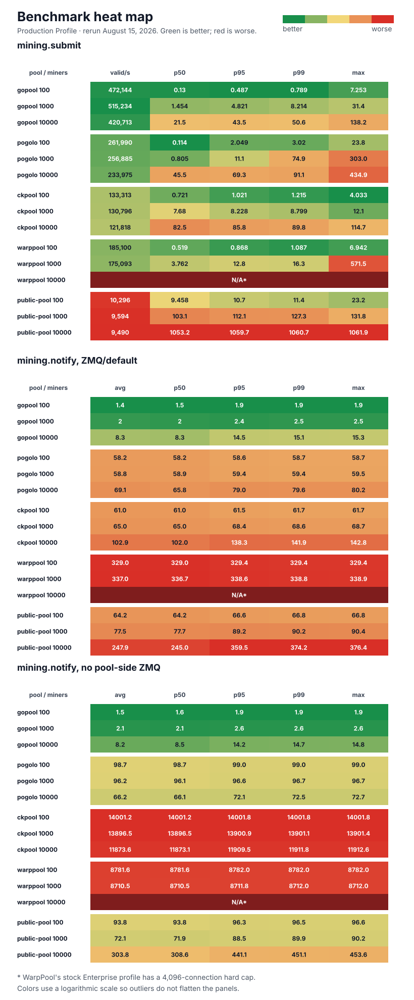

# Go benchmarks

Benchmarks for `mining.submit` and `mining.notify`. Use
`scripts/run-go-benchmarks.sh` to reproduce the full local regtest benchmark
suite and regenerate the SVG.

## Current results

The heat map shows the unpinned August 15, 2026 production-profile rerun on a
32-logical-CPU host. The older August 13 raw result matrix is committed as
[`go-benchmarks-20260813T184353Z.jsonl`](../../reports/go-benchmarks/go-benchmarks-20260813T184353Z.jsonl).
That run predates the profile and worker-identity rules below, so it remains a
legacy, unlabeled result set and must not be presented as the production-profile
comparison shown in the heat map.

Results produced by this suite are labeled **production profile**. The goPool
adapter keeps normal submit validation, vardiff, cumulative hashrate telemetry,
recent-window telemetry, the ordinary three-hour saved-worker-history flush,
and expired-ban startup maintenance enabled. Connection-rate limits and
invalid-submit bans alone are relaxed so synthetic `10000`-miner reject-load
runs can complete; those accommodations are recorded in result metadata
separately from the profile label.

Every simulated connection authorizes a unique `wallet.wN` worker, including
CKPool. The logging rule is uniform across adapters: do not write per-share
records to disk, but keep error logging enabled. CKPool therefore runs at
`LOG_ERR` without its `-L` per-share logging switch, and debug/network-share
logging is disabled in the other adapters.

Pool and probe CPU pinning is disabled. The harness does not set `GOMAXPROCS`
or an equivalent CPU quota, so every implementation retains unrestricted
multicore scheduling.

The suite also includes dvb-WarpPool v1.25.6 and public-pool's default
single-process deployment. The WarpPool adapter builds the pinned upstream
source without source patches and selects its shipped Enterprise profile. The
harness supplies RPC/ZMQ/listen settings, relaxes connection-rate limits, and
uses a 10-second polling interval for the no-ZMQ test. The stock Enterprise
connection cap remains 4,096, so all three `10000`-miner WarpPool cells are
explicitly recorded and rendered as failures.



Every numeric value is a colored tile. Each metric column is logarithmically
scaled independently so outliers do not collapse the useful color range; green
is better and red is worse. Displayed values remain the raw measurements.
WarpPool's `10000`-miner rows are marked `N/A*`, with its stock
4,096-connection hard cap noted below the chart.

The SVG includes `mining.submit`, `mining.notify` with ZMQ/default pool
configuration, and `mining.notify` with pool-side ZMQ disabled.

## Reproduce

Run the full benchmark suite from the repository root:

```bash
./scripts/run-go-benchmarks.sh
```

The script builds the Go probes, prepares the open-pool-benchmark regtest
environment, starts a fresh pool instance for every matrix cell, runs `100`,
`1000`, and `10000` miner cases, writes raw JSONL/log output under
`reports/go-benchmarks/`, and regenerates `benchmarks/go/heatmap.svg`. Fresh
instances keep submit load, connection churn, and earlier notify rounds from
affecting later measurements. Result metadata records the production-profile,
logging, unique-worker, and unrestricted-multicore rules.

Useful knobs:

```bash
GO_BENCH_POOLS=gopool,pogolo,ckpool,warppool,public-pool
GO_BENCH_MINERS=100,1000,10000
GO_BENCH_SUBMIT_DURATION=8s
GO_BENCH_NOTIFY_ROUNDS=5
GO_BENCH_OUT_DIR=reports/go-benchmarks
GO_BENCH_SVG=benchmarks/go/heatmap.svg
GO_BENCH_RENDER_SVG=1
```

For a quick wiring check without replacing the committed SVG:

```bash
GO_BENCH_POOLS=gopool GO_BENCH_MINERS=100 GO_BENCH_SUBMIT_WARMUP=1s \
GO_BENCH_SUBMIT_DURATION=1s GO_BENCH_NOTIFY_ROUNDS=1 GO_BENCH_RENDER_SVG=0 \
./scripts/run-go-benchmarks.sh
```

To render an SVG again from a saved JSONL run:

```bash
./scripts/render-go-benchmark-heatmap.py reports/go-benchmarks/<run>.jsonl \
  -o benchmarks/go/heatmap.svg
```

The lower-level environment wrapper is still available for manual inspection:

```bash
./scripts/go-benchmark-env.sh --help
```
